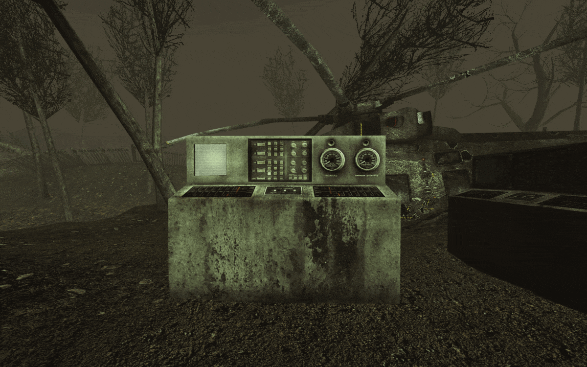

[Marco]: https://steamcommunity.com/profiles/76561197975509070

# BitCore

[](https://github.com/InsultingPros/BitCore/releases)

## General Information

Thanks to [Marco] for sharing the mut to public!

All I added on top of his work:

- Added default configs.
- Changed code formatting.

## Features



- You can play the game or spectate others.
- Gain scores and check the highscores.
- Use admin `mutate` commands to add / remove **BIT.CORE** machines.

```cmd
mutate AddBitGame
mutate RemoveBitGame
```

## Installation

```cpp
BitCore.BitMut
```

## Building and Dependancies

Use [KF Compile Tool](https://github.com/InsultingPros/KFCompileTool) for easy compilation.

```cpp
EditPackages=BitCore
```

## Credits

- [Marco] - author of the original version.

## Steam workshop

<https://steamcommunity.com/sharedfiles/filedetails/?id=2972747814>
